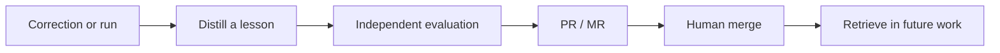

# Moneta

**Your corrections should outlive the conversation.**

You review an agent's PR. Wrong API. Missed convention. A responsibility it overlooked. You explain the fix. Moneta gives that feedback a path into the next run: extract the lesson, evaluate it, propose a change, retrieve it when relevant.

Native plugins for **Codex** and **Claude Code**. Moneta is the bootstrap for your own agentic memory system: a personal Git repository of Markdown nodes and JSON schemas, cloned locally by the agent. Every proposed improvement is reviewable as a GitHub PR or GitLab MR.

> "Use our shared API client. Preserve its retry behavior."
>
> A correction today can become scoped guidance for tomorrow's coding agent, with its source, evaluation, and review history attached.

**Get started**

You need Git, Node.js, Codex or Claude Code, and **either gh or glab installed** for the host where you will store memories. Init checks existing authentication. If login is needed, the wizard starts it; you complete the browser/device approval, and setup resumes.

For self-hosted GitLab, tell init your host. Installing this private Moneta plugin also requires GitHub access; authenticating glab does not grant access to the bootstrap.

**1. Install your plugin directly.** Run one block in your terminal. The plugin manager downloads Moneta; no manual source clone is needed.

Codex:

```sh
codex plugin marketplace add asafchn/Moneta
codex plugin add moneta@moneta-native
```

Claude Code:

```sh
claude plugin marketplace add asafchn/Moneta
claude plugin install moneta@moneta-native
```

**2. Run the setup wizard.** Open a fresh agent session in your working project. Enter `$init` in Codex chat or `/moneta:init` in Claude Code chat. These are agent-chat commands, not terminal commands.

Init asks one question at a time:

- GitHub (`gh`) or GitLab (`glab`)? It verifies the chosen CLI's account and starts browser login if needed.
- Create a repository or use an existing URL?
- For new: your personal account or an organization/group, then its name and repository visibility. **Private is recommended for either owner type.**
- The agent's role file, if you want to enroll one and its path is not already known.

Init creates your own Moneta repository or proposes additions to the existing one. It automatically clones your memory repository locally for retrieval, returns its URL and setup PR/MR, and writes `.moneta.md` in your working project. **Review and merge the setup proposal**, then tell the agent: "Setup is merged. Refresh memory and verify retrieval." Setup is ready when it reports the reviewed revision and successful retrieval.

Enable plugin/hooks through your host's trust controls if prompted. If commands are missing, see [installation help](docs/NATIVE-COMPATIBILITY.md).

**3. Use evolve. Let it pick the flow.** You describe what you want; Moneta uses context or asks a short question when the choice is unclear.

| What you want | Codex chat example |
|---|---|
| Learn from the last correction | `$evolve Learn from my last correction.` |
| Review the current run | `$evolve Review this whole run.` |
| Analyze a saved run | `$evolve Analyze the run in "path/to/session.txt".` |
| Set up missing memory | `$evolve Set up Moneta for this project.` |

In Claude Code, replace `$evolve` with `/moneta:evolve`. Moneta handles analysis, evaluation and the PR/MR when a useful change is supported. Merge accepted proposals so later retrieval can use them. A supported no-change result is also valid.

**General or one agent.** Without `agent-slug`, init and evolve use `memory/general/` only. For a named agent, use `$init agent-slug: coding-agent` and `$evolve agent-slug: coding-agent Learn from my last correction.` Claude accepts the same arguments after `/moneta:init` or `/moneta:evolve`. There is no cross-agent search or fallback to general; context selects the flow, never a different memory area.

**From feedback to memory**



- **One correction:** a fast local hook screens user feedback. The agent decides whether a reusable lesson warrants `evolve-message`.
- **One entry point:** `evolve` chooses setup, one-message learning, current-run analysis or a captured `.txt` transcript. An `evolve-agent` analyzes the request, actual work, responsibilities, and human corrections.
- **One reviewable change:** a separate evaluator combines agent judgment with available deterministic checks and recorded metrics. Useful candidates become proposals; human merge makes them eligible for ordinary retrieval.

**Memory the agent can navigate**

```text
my-moneta/
  skills/                     # bootstrap workflows and schema templates
  native/                     # native host adapters
  plugins/                    # installable Codex and Claude Code packages
  memory/
    general/                  # used when no agent-slug is supplied
      indexes/                # schema definition, node descriptions, agent index
      agent-responsibility/
      coding-guidelines/
      domain-knowledge/       # sourced facts, concepts and terminology
      tool-calls/
      skills/
      guard-rails/
      agentic-flow-context/
      schemas/                # JSON definitions and Markdown schema nodes
    coding-agent/             # same layout; selected only by explicit agent-slug
```

Each node is a Markdown file: typed YAML frontmatter for discovery, a body for detail. Named edges describe the relationship in both directions. The schema-definition index explains those types and relations; the node index pairs every slug with a description.

Before work, the agent uses the indexes to form a query, **finds matching frontmatter, walks relevant direct relations, then reads selected bodies**. It retrieves from a verified reviewed revision. Domain-knowledge nodes participate in the same search, with cited sources and applicability. Evaluation criteria and results stay outside it and use the separate evaluation skill.

Moneta learns by changing the knowledge available to future runs. Model weights stay untouched. A promising lesson still needs evidence: evaluator scores are judgments, and passing a check establishes only what that check measured. Future performance gains require subsequent evaluation.

**Inside the plugins**

Both packages include six skills, analysis and evaluation roles, graph templates, schemas, and hooks for `SessionStart`, `UserPromptSubmit`, `SubagentStart`, and `PreToolUse`. The small Node.js hook supplies context and screens messages; the agent performs retrieval and review using existing tools. The feedback screen uses bounded English phrase matching, so explicit `evolve-message` remains available when it misses a correction.

| Directory | Purpose |
|---|---|
| `skills/` | Shared workflows, references, schemas, and graph templates |
| `native/` | Host manifests, role definitions, and shared hooks |
| `plugins/moneta-codex/` | Generated, installable Codex package |
| `plugins/moneta-claude-code/` | Generated, installable Claude Code package |

Edit the shared sources, then regenerate and check:

```sh
python tools/package_plugins.py
python tools/package_plugins.py --check
node --test tests/message-gate.test.cjs tests/native-hooks.test.cjs
```

[Schema walkthrough](docs/schema-proposal.html) | [Design requirements](docs/REQUIREMENTS.md) | [Course grounding](docs/course-grounding.md) | [Validation](docs/VALIDATION.md)

Course grounding distinguishes lecture-backed principles from Moneta's design choices. The graph format and node taxonomy follow this project's requirements.
