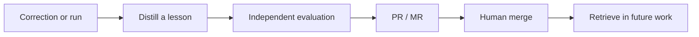

# Moneta

**Your corrections should outlive the conversation.**

You review an agent's PR. Wrong API. Missed convention. A responsibility it overlooked. You explain the fix. Moneta gives that feedback a path into the next run: extract the lesson, evaluate it, propose a change, retrieve it when relevant.

Native plugins for **Codex** and **Claude Code**. Shared memory lives in a Git repository of Markdown nodes and JSON schemas, cloned locally by the agent. Every proposed improvement is reviewable as a GitHub PR or GitLab MR.

> "Use our shared API client. Preserve its retry behavior."
>
> A correction today can become scoped guidance for tomorrow's coding agent, with its source, evaluation, and review history attached.

**From feedback to memory**



- **One correction:** a fast local hook screens user feedback. The agent decides whether a reusable lesson warrants `evolve-message`.
- **One run:** invoke `evolve` on the current session or a captured `.txt` transcript. An `evolve-agent` analyzes the request, actual work, responsibilities, and human corrections.
- **One reviewable change:** a separate evaluator combines agent judgment with available deterministic checks and recorded metrics. Useful candidates become proposals; human merge makes them eligible for ordinary retrieval.

**Install**

Use an account with access to this private repository. Git and Node.js must be on PATH; repository workflows use authenticated `gh` for GitHub or `glab` for GitLab.

Codex:

```sh
codex plugin marketplace add asafchn/Moneta
codex plugin add moneta@moneta-native
```

Claude Code:

```sh
claude plugin marketplace add asafchn/Moneta
claude plugin install moneta@moneta-native
```

Run initialization on the agent you want to connect:

| Action | Codex | Claude Code |
|---|---|---|
| Connect an agent | `$evolve-init` | `/moneta:evolve-init` |
| Learn from a run or transcript | `$evolve` | `/moneta:evolve` |
| Analyze one correction | `$evolve-message` | `/moneta:evolve-message` |

Init asks whether to **create a new GitHub repository or use an existing GitHub/GitLab repository**, then binds the agent to a domain and role file. Multiple agents can share a domain. It proposes initial knowledge through review, writes the local `.moneta.md` connection, and adds skill invocations to the agent's instructions.

Host discovery and hook trust controls apply. Codex agent roles are registered by init. See [native installation and compatibility](docs/NATIVE-COMPATIBILITY.md).

**Memory the agent can navigate**

```text
knowledge-repository/
  engineering/
    indexes/                  # schema definitions, node descriptions, agent identities
    agent-responsibility/    # one responsibility node per agent
    coding-guidelines/
    tool-calls/
    skills/
    guard-rails/
    agentic-flow-context/
    schemas/                 # JSON definitions and Markdown schema nodes
  another-domain/
```

Each node is a Markdown file: typed YAML frontmatter for discovery, a body for detail. Named edges describe the relationship in both directions. The schema-definition index explains those types and relations; the node index pairs every slug with a description.

Before work, the agent uses the indexes to form a query, **finds matching frontmatter, walks relevant direct relations, then reads selected bodies**. It retrieves from a verified reviewed revision. External domain knowledge keeps its own source; evaluation criteria and results use the separate evaluation skill.

Moneta learns by changing the knowledge available to future runs. Model weights stay untouched. A promising lesson still needs evidence: evaluator scores are judgments, and passing a check establishes only what that check measured. Future performance gains require subsequent evaluation.

**Inside the plugins**

Both packages include seven skills, analysis and evaluation roles, graph templates, schemas, and hooks for `SessionStart`, `UserPromptSubmit`, `SubagentStart`, and `PreToolUse`. The small Node.js hook supplies context and screens messages; the agent performs retrieval and review using existing tools. The feedback screen uses bounded English phrase matching, so explicit `evolve-message` remains available when it misses a correction.

| Directory | Purpose |
|---|---|
| `skills/` | Shared workflows, references, schemas, and graph templates |
| `native/` | Host manifests, role definitions, and shared hooks |
| `plugins/moneta-codex/` | Generated, installable Codex package |
| `plugins/moneta-claude-code/` | Generated, installable Claude Code package |

Edit the shared sources, then regenerate and check:

```sh
python tools/package_plugins.py
python tools/package_plugins.py --check
node --test tests/message-gate.test.cjs tests/native-hooks.test.cjs
```

[Schema walkthrough](docs/schema-proposal.html) | [Design requirements](docs/REQUIREMENTS.md) | [Course grounding](docs/course-grounding.md) | [Validation](docs/VALIDATION.md)

Course grounding distinguishes lecture-backed principles from Moneta's design choices. The graph format and node taxonomy follow this project's requirements.
